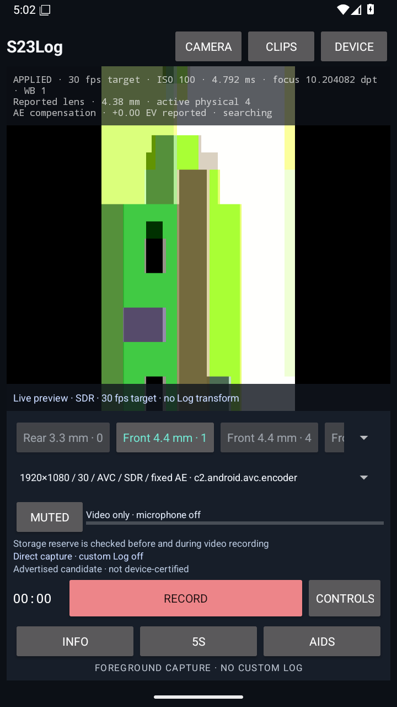
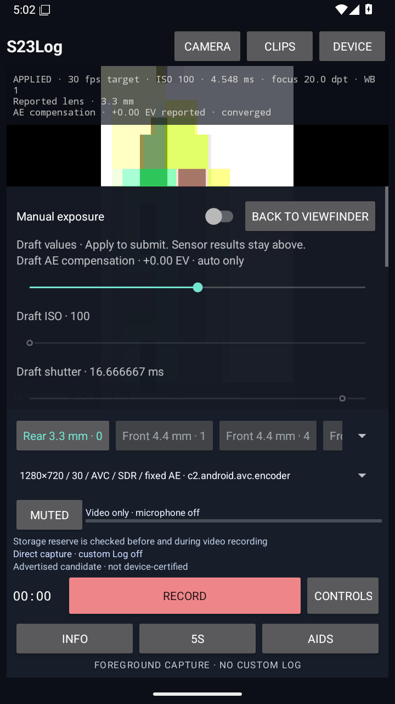
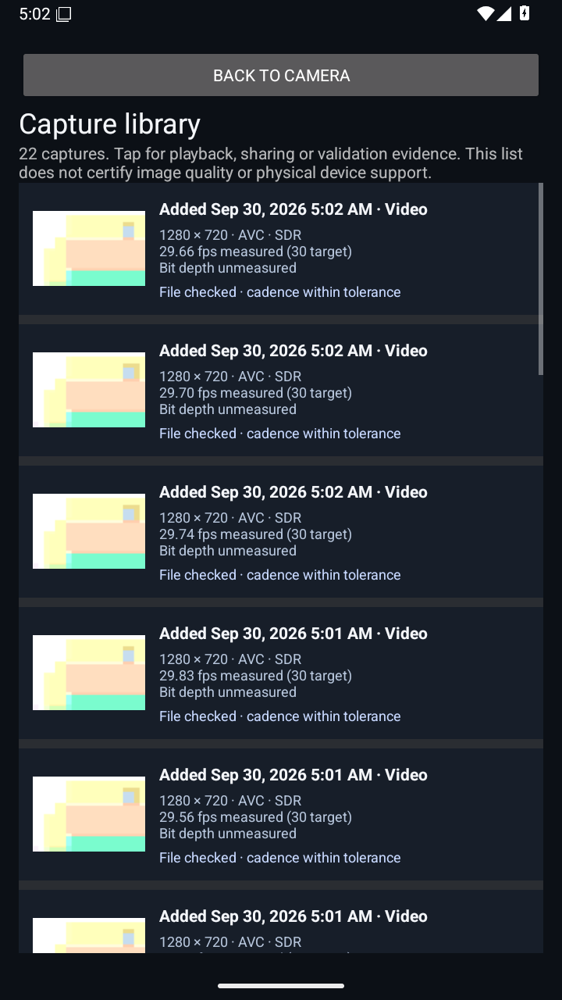
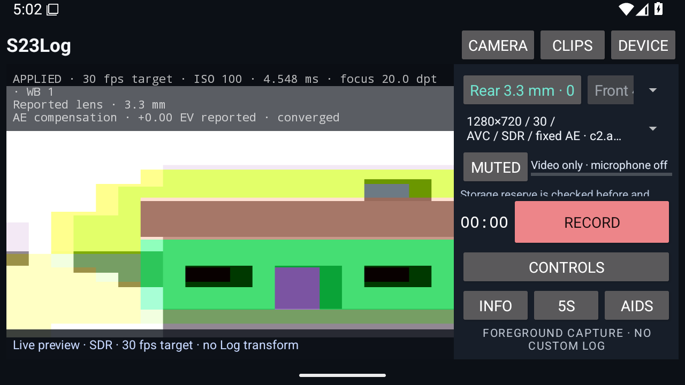
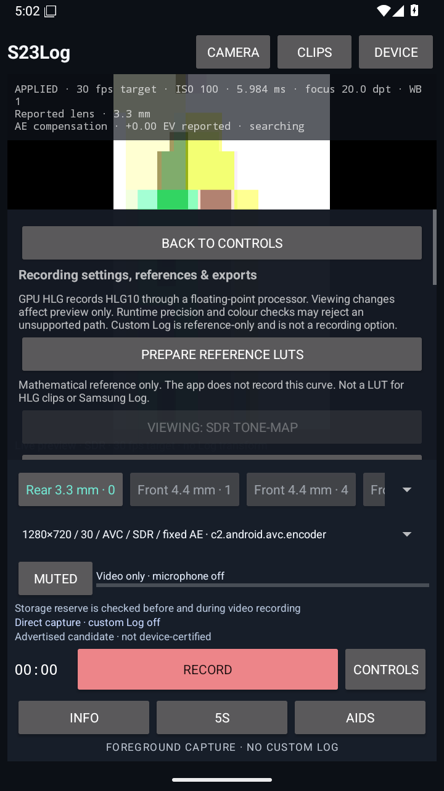
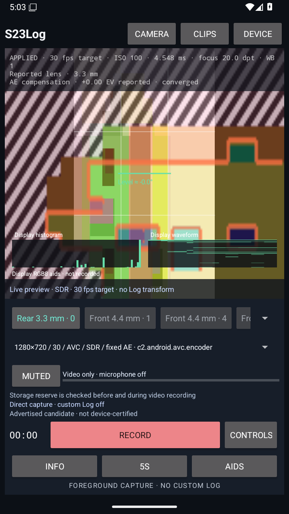

# S23Log engineering overview

S23Log is a native Kotlin/XML camera application built around a specific problem: useful manual capture controls must not overstate what a phone or encoder actually supports, and a failed recording must not silently destroy nonempty footage.

## Product surfaces

These are unedited native API 36 emulator captures from source `ad0e42f`, not mockups or physical S23 Ultra images. Original byte identities and dimensions are retained in [the image source manifest](images/sources.json).

  



 

The scrolling metadata region and partial-height drawers deliberately leave capture actions outside scrolling content. Draft controls do not change the camera until Apply. Missing saved formats require explicit reselection rather than a silent fallback. Display aids are clearly separate from encoded colour and physical exposure calibration.

## Architecture

```
Camera2 capability catalog → explicit route + complete mode plan
  → generation-checked camera/session owner
  → direct Surface or eligible FP16/RGB10 HLG processor
  → video codec + dedicated microphone reader / bounded AAC handoff
  → common-timeline mux owner → staged media → validation → publication
                                      ↘ nonempty-footage recovery

Capture results + control intent → bounded evidence journal
Final original bytes → SHA-256 identity → capture index / matching report
```

Capture, monitoring, file validation and physical qualification are separate contracts. Lifecycle generations reject stale callbacks. The microphone's native owner is independent of codec/disk callbacks, while accepted PCM is bounded and never silently evicted. Finalized original videos are paired with their reports by digest and byte count, rather than filename/count coincidence.

## Verification snapshot

[Accepted campaign: ad0e42f](https://github.com/azerish25-ux/S23-ultra-camera-log-application/actions/runs/36670584939). The retained [machine-readable summary](evidence/ad0e42f-verification.json) records:

- 244 JVM tests and 76 host validation regressions
- 46 native emulator tests, plus a separately executed microphone-permission-denial test
- 25 complete decoded movies, all paired with the original device reports; six contain decoded audio
- A 65.4-second audio/video take with all 3,132,074 read PCM frames queued, no handoff overflow and no silent eviction
- Real UI screenshots and full-action visibility/text checks in portrait, landscape and 130% text size
- Synthetic GPU precision/negative-control checks and independently consumed, versioned reference LUT exports
- Debug/release builds, zero lint errors in both variants, verified debug signature and fail-closed release-signing configuration checks; lint warnings remain

The UI tests found and led to fixes for a six-pixel row-alignment clip and a large-text Record button truncation. A separate campaign hit the existing two-second PCM overflow guard and retained recoverable footage; the guard and long-take acceptance threshold were kept, and scheduling/runner diagnostics were added. A subsequent full campaign passed. This is evidence of the observed runs, not a guarantee against resource overload or physical-device failure.

## Honest product boundaries

HLG is not proprietary Samsung Log. The reference Log curve/LUT exports are mathematical preparation, not an enabled recording format. The emulator does not expose the tested HDR camera/rendered-encoder route, so that hardware stage remains unavailable. Synthetic GPU ramps do not close it.

Actual S23 Ultra diagnostics, per-lens/format captures, sustained 4K/8K and thermal testing, physical audiovisual synchronization, editor interpretation and release-key/update acceptance remain required. See [implementation status](IMPLEMENTATION_STATUS.md), [device acceptance](DEVICE_TEST_PLAN.md) and [release signing](RELEASE_SIGNING.md). No production key or store release is implied by an installable debug APK.
